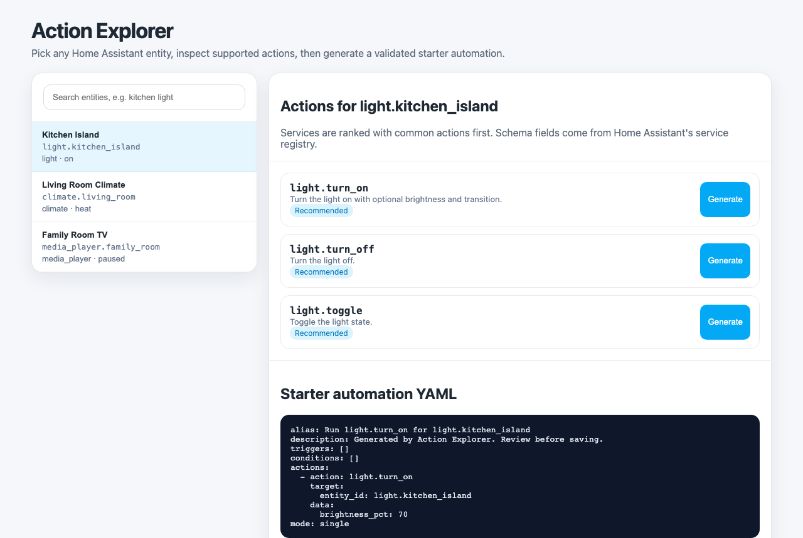

# Action Explorer for Home Assistant

Action Explorer is a HACS-ready Home Assistant custom panel that starts from the thing you care about: an entity or device. Select an entity, inspect the services Home Assistant says it supports, see service schemas and examples, then generate a starter automation action block.



## Why

Home Assistant's UI is good at browsing from **Action → entity**. It is harder for new users to answer **Entity/device → what can I do with it?** This panel makes that direction explicit.

## Current MVP

- Side panel registered at **Action Explorer**.
- Entity search powered by the Home Assistant state machine.
- Per-entity action list generated from Home Assistant's live service registry.
- Recommended/common actions ranked first for lights, switches, covers, climate, media players, fans, locks, buttons, scenes and automations.
- Starter automation YAML generated after validating that the selected entity exists and the selected service is registered.
- No cloud service, no telemetry, no external API calls.

## Install with HACS

1. HACS → Integrations → three-dot menu → Custom repositories.
2. Add this repository URL as an **Integration**.
3. Install **Action Explorer**.
4. Restart Home Assistant.
5. Settings → Devices & services → Add integration → **Action Explorer**.
6. Open the **Action Explorer** item in the sidebar.

## Manual install

Copy `custom_components/action_explorer` into your Home Assistant `custom_components` directory, restart Home Assistant, then add the integration through Settings → Devices & services.

## Security model

- All API endpoints require Home Assistant authentication.
- The integration does not mutate Home Assistant configuration. The POST endpoint only validates the selected entity/service and returns starter YAML for the user to review.
- The frontend renders user-controlled names and YAML with DOM `textContent`, not unsafe HTML interpolation.
- The integration does not send data outside your Home Assistant instance.

## Development

```bash
# Node 22+ is recommended; CI uses Node 22.
npm ci
npm run check
python -m py_compile custom_components/action_explorer/*.py
npm run screenshot
```

The built panel bundle is committed at `custom_components/action_explorer/www/action-explorer-panel.js` so HACS can install the integration without a Node build step. CI fails if the bundle drifts from `src/action-explorer-panel.js`.

## Limitations

- This MVP lists entity-domain services. Full device automation capabilities and integration-specific device triggers are planned.
- Generated YAML is a starter snippet, not an automatic write into `automations.yaml`.
- Service descriptions and field schemas depend on what Home Assistant exposes through the runtime service registry; some services may only show their action name and an example payload.

## Roadmap

- Device-first browsing via entity registry device IDs.
- Device triggers, conditions and actions where integrations expose them.
- Script generation alongside automation snippets.
- One-click copy buttons and import guidance.
- Optional admin-only mode to save generated automations directly.
